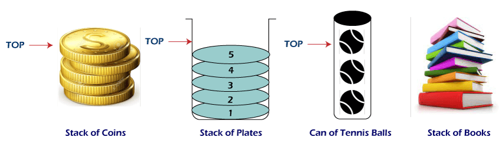
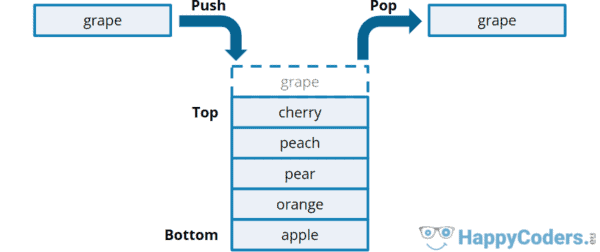

# Stack

## What is a Stack?
A **stack** is a linear data structure that is characterized by the order in which items are added and removed. Typically, stacks take the approach of "last in first out" (**LIFO**).

</br>

## Physical Example
If you were at a library reading picture books, you would most likely start making a pile of books you've finished reading. 

Each time you finish a book and add it to the top of the stack, this is called a **push** operation. In coding terms, we say it was added to the **back** of the stack.

If you decide to reread a book, and take it off the finished pile, this is called a **pop** operation.

Notice that push and pop operations happen from the back of the stack. Normally, removing from the middle of the stack is not allowed.

The book at the **front** is the very first book read. A LIFO structure can result in data not being used for a long time. This might not be the ideal structure for all scenarios but the real benefit of the stack is the ability to remember "what books we have read" or where we have been.



</br>

## Some Uses in Software
### Undo and History
One of the most common implementations of a stack, is the undo feature. If we typed the names of some fruit those names would be added to a stack. We could then used undo to pop the last fruit from the stack.  



This is possible because the stack maintains a history of what was typed. Thus, pressing undo guarantees that the last element added to the stack will be the one removed.

Stacks are useful when we need to maintain history and perform an operation (like undo) backwards.

</br>

### Function Calls
When a function is called, the computer needs to know two basic things:
* The function being called
* What function to return to once finished

This could quickly get complicated as one function calls another function, which calls several other functions. Thus, the computer uses a stack of functions to know which function to return to once one call finishes.

The stack also keeps track of where in the previous function we were at and the memory we were using.

</br>

## Big O Notation
In python, a stack can be represented by using a list. The performance of the stack using a Python list is based on the performance of the dynamic array.

Common Operation  | Python Code | Performance
----------------  | ----------- | -----------
push(value) | my_stack.append(value) | O(1) - Performance of adding to the end of a dynamic array
pop() | value = my_stack.pop() | O(1) - Performance of removing from the end of a dynamic array
size() | length = len(my_stack) | O(1) - Performance of returning the size of the dynamic array
empty() | if len(my_stack) == 0: | O(1) - Performance of checking the size of the dynamic array

</br>

## Code Example
### Reverse Individual Words
Given a string, we want to print the reverse of each individual word. For example: \
&nbsp;&nbsp;&nbsp;&nbsp;`Input: Hello World` \
&nbsp;&nbsp;&nbsp;&nbsp;`Output: olleH dlroW`

Method: Use a stack to push all words before a space. As soon as we encounter a space, we empty the stack.

```python
# O(n) run time

def reverseWords(string):
    st = list()

    # Traverse given string and push all characters
    # to stack until we see a space.
    for i in range(len(string)):
        if string[i] != " ":
            st.append(string[i])

        # When we see a space, we print
        # contents of stack.
        else:
            while len(st) > 0:
                print(st[-1], end="")
                st.pop()
            print(end=" ")

    # Since there may not be space after last word.
    while len(st) > 0:
        print(st[-1], end="")
        st.pop()

# Run Code
if __name__ == "__main__":
    string = "Hello World"
    reverseWords(string)
```

</br>

## Practice Problem
### Tower of Hanoi
The Tower of Hanoi is a mathematical puzzle. It consists of three poles and a number of disks of different sizes which can slide onto any pole. The puzzle starts with the disk in a neat stack in ascending order of size on one pole, the smallest at the top thus making a conical shape. 

The objective of the puzzle is to move all the disks from one pole (say ‘source pole’) to another pole (say ‘destination pole’) with the help of the third pole (say auxiliary pole).

The puzzle has the following two rules:
1. You can’t place a larger disk onto a smaller disk
2. Only one disk can be moved at a time

Try to solve the puzzle in the least number of moves possible.
Example: \
&nbsp;&nbsp;&nbsp;&nbsp;`Input: 3 disks` \
&nbsp;&nbsp;&nbsp;&nbsp;`Output: 7 moves`

[Solution](hanoi_tower_solution.py)

</br>

## Return
[Back to Welcome Page](0_welcome.md)
