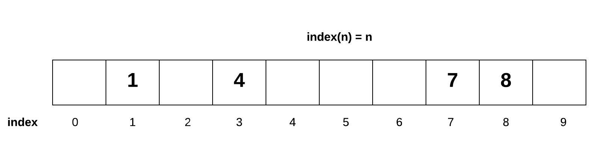
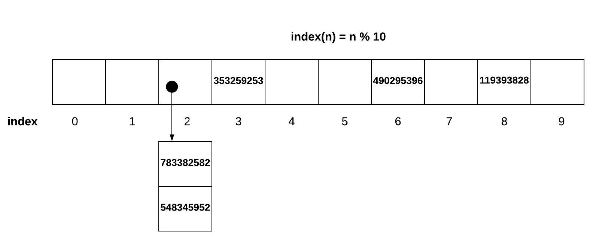

# Set

## What is a Set?
A **set** is a data structure that stores a collection of unique values in any order. 

It is important to note that, with sets, the order of the data is not important but no duplicate values are allowed. Most set implementations will not give an error when you try to add a duplicate value. This is done so that a list, which may have duplicates, can easily be converted to a set. 

Due to these two key characteristics, a technique called **hashing** is used to add, remove, and check for a value in O(1) time.

</br>

## Hashing
Hashing is designed to solve the problem of needing to efficiently find or store an item in a collection.

For example, is we have a list of 10,000 numbers and we want to check if a given number is in the list, it would be inefficient to successively compare the word with all 10,000 items until we find a match. This would be O(n) efficiency, which isn't terrible, but not great for large data sets.

This is why hashing is useful. It is a way to narrow down our search; typically, by generating an index at which the value we are looking for is stored.

Normally, values are added to a set following this function **index(n) = n**. If we wanted to know if a number existed in the list, we would use the formula to lookup the index. This would result in an O(1) performance. We call this a **sparse list** because the list is not guaranteed to be filled from left to right.



However, what if we need to store larger numbers, such as numbers 0-999,999,999? We would need a list size of 1 billion. This would work, but would take up a lot of memory. We can save memory and still use large numbers by using the modulo operator. With the equation **index(n) = n % 10** we would be able to store the value 353,259,253 at index 3 instead of 353,259,253.


The equation **index(n) = n % 10** can further be generalized into **index(n) = hash(n) % sparse_list_size**. This function can be used for integers, floats, and strings. The hash(n) represents what is called a **hashing function**. The hashing function will convert non-integers into integers so that the modulo operation can be performed. Though, not everything can be hashed. For example, a list in Python cannot be hashed.

Hashing is a great tool to improve performance, but what happens if we try to add multiple values to the same index? This is called a conflict.

</br>

## Resolving Conflicts
### Option 1
The first option to deal with hashing conflicts is called **open addressing**. If we find that something already occupies the index value we are trying to use, open addressing will tell us to move to the next available space. This normally means looking to the right one spot at a time until an open space is found. The downside to this approach is that more conflicts can result from trying to resolve one conflict.

If there was a conflict in using index 2, we would move over to index 3. Later, we try adding another value that would be stored at index 3, since index 3 was used to resolve our last conflict, we now have another conflict. This pattern can result in a rapidly growing loop of conflicts.


</br>

### Option 2
The second option is called **chaining**. Instead of looking for an empty index for our data, we can make a list of values that occupy the same space.



</br>

### Adverse Effects
Besides the previously mentioned downside to open addressing, both options poorly affect performance. The use of the hashing function is what gives us O(1) timing. If we have to search through several positions or a chained list to find a value, we will have O(n) performance if the amount of conflict is high.

To avoid this, we need to increase the size of the sparse list if the amount of conflict is too high. If we take this action, we also need to reposition all of the values by running the index(n) function again with the increased sparse list size.

</br>

## Some Uses
There are many uses for a set. The three most common uses are:
* Find unique values in a list
* Allow quick access to previously calculated results
* Perform mathematical operations such as an **intersection** (common values between two sets) and a **union** (all values within two sets)

In Python, a set can be represented using curly braces: **my_set = {1, 2, 3}** To create an empty set, we use: **empty_set = set()** To determine membership in a set: the **in** operator is used.

The Python library also includes a class called **dict**, which stands for dictionary, that is built using a set. A dictionary also uses the curly brace notation.

</br>

## Big O Notation
The performance of the set is based on the performance of the hashing algorithm and the assumption that good conflict resolution is being applied.
Common Operation | Python Code | Performance
---------------- | ----------- | -----------
add(value) | my_set.add(value) | O(1) - Performance of hashing the value
remove(value) | my_set.remove(value) | O(1) - Performance of hashing the value
member(value) | f value in my_set: | O(1) - Performance of hashing the value
size() | length = len(my_set) | O(1) - Performance of returning the size of the set

</br>

## Code Example
### Maximum and Minimum
Given a set, find the maximum and minimum values.
&nbsp;&nbsp;&nbsp;&nbsp;`Input: set = ([8, 16, 24, 1, 25, 3, 10, 65, 55])` \
&nbsp;&nbsp;&nbsp;&nbsp;`Output: max is 65, min is 1`

Method: use built in Python functions to find maximum and minimum values while traversing the set.

```python
# Get the maximum element from a set
def MAX(sets):
    return (max(sets))

# Get the minimum element from a set
def MIN(sets):
    return (min(sets))
     
sets = set([8, 16, 24, 1, 25, 3, 10, 65, 55])
print(MAX(sets))
print(MIN(sets))
```
</br>

## Practice Problem
### Find Missing/Additional Values of Two Lists
Given two lists, find the missing and additional values in both the lists.

Example: \
&nbsp;&nbsp;&nbsp;&nbsp;`Input: list1 = [1, 2, 3, 4, 5, 6]` \
&nbsp;&nbsp;&nbsp;&nbsp;&nbsp;&nbsp;&nbsp;&nbsp;&nbsp;&nbsp;&nbsp;&nbsp;&nbsp;&nbsp;&nbsp;&nbsp;&nbsp;&nbsp;`list2 = [4, 5, 6, 7, 8]` \
&nbsp;&nbsp;&nbsp;&nbsp;`Output: Missing values in list1 = [8, 7]` \
&nbsp;&nbsp;&nbsp;&nbsp;&nbsp;&nbsp;&nbsp;&nbsp;&nbsp;&nbsp;&nbsp;&nbsp;&nbsp;&nbsp;&nbsp;&nbsp;&nbsp;&nbsp;&nbsp;&nbsp;`Additional values in list1 = [1, 2, 3]` \
&nbsp;&nbsp;&nbsp;&nbsp;&nbsp;&nbsp;&nbsp;&nbsp;&nbsp;&nbsp;&nbsp;&nbsp;&nbsp;&nbsp;&nbsp;&nbsp;&nbsp;&nbsp;&nbsp;&nbsp;`Missing values in list2 = [1, 2, 3]` \
&nbsp;&nbsp;&nbsp;&nbsp;&nbsp;&nbsp;&nbsp;&nbsp;&nbsp;&nbsp;&nbsp;&nbsp;&nbsp;&nbsp;&nbsp;&nbsp;&nbsp;&nbsp;&nbsp;&nbsp;`Additional values in list2 = [7, 8]`

[Solution](miss_add_solution.py)

</br>

## Return
[Back to Welcome Page](0_welcome.md)